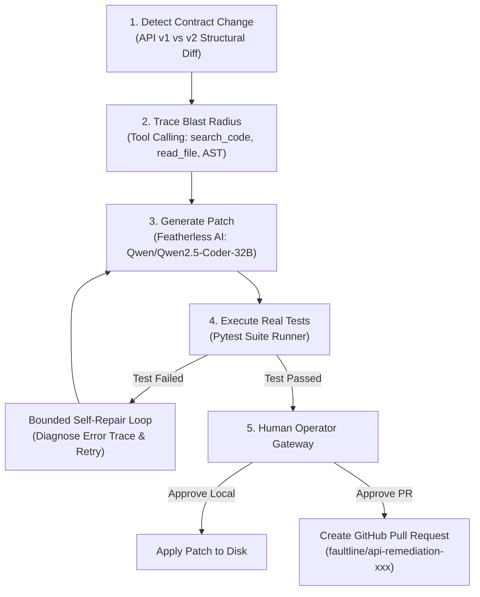

# ⚡ FAULTLINE: Autonomous API-Change Remediation Engine

> **The AI that fixes the code your API changes break.**

[-58a6ff?style=for-the-badge&logo=openai)](https://featherless.ai)
[](https://fastapi.tiangolo.com)
[](https://vitejs.dev)
[](https://docs.pytest.org)

---

## 📌 Overview

When an upstream API changes a payload schema (for example, renaming `user_id` to `account_id`), existing tooling only tells developers that something broke. **Faultline goes further**: it autonomously investigates the codebase, traces the blast radius, generates a backward-compatible patch, verifies it with real unit tests, and retries when tests fail — keeping a human operator in control before anything is applied to production.

---

## 🔁 Closed-Loop Remediation Architecture



---

## ✨ Key Features

- **🔍 Deterministic Contract Diffing**: Detects breaking API payload changes (e.g. field renames, removals, type mismatches).
- **🕸️ AST Blast Radius Engine**: Uses agentic tool calls (`search_code`, `read_file`, `analyze_dependency`) to construct an evidence-backed impact tree down to exact line numbers.
- **🤖 Featherless AI Patch Generator**: Powered by `Qwen/Qwen2.5-Coder-32B-Instruct` to generate backward-compatible patches retaining legacy field fallbacks.
- **🧪 Bounded Pytest Retry Loop**: Runs real unit tests in an isolated sub-process with automated failure diagnosis and retry loops.
- **🔒 Human-in-the-Loop Gateway**: Enforces human operator review before code is applied or committed.
- **🐙 Automated GitHub PR Integration**: Creates clean GitHub Pull Requests complete with branch management, blast radius summaries, and test evidence.
- **🛡️ Security-Hardened Architecture**: Prepared with `debug=False`, `slowapi` rate limiting (5 req/min), CORS origin locking, and Pydantic POST payload validation.

---

## 🚀 Quick Start

### 1. Repository Setup

Clone the repository:
```bash
git clone https://github.com/eswarraol/faultline-mvp.git
cd faultline-mvp
```

### 2. Backend Setup (FastAPI)

```bash
cd backend
python -m venv venv
# On Windows:
.\venv\Scripts\activate
# On Linux/macOS:
source venv/bin/activate

pip install -r requirements.txt
```

Create a `backend/.env` file:
```env
FEATHERLESS_API_KEY=your_featherless_api_key_here
GITHUB_TOKEN=optional_github_personal_access_token
```

Start the FastAPI backend server:
```bash
python -m uvicorn main:app --host 127.0.0.1 --port 8000
```

### 3. Frontend Setup (React + Vite)

In a new terminal window:
```bash
cd frontend
npm install
npm run dev
```

Open `http://localhost:3000` in your browser.

---

## 🌐 Vercel Cloud Deployment

The frontend includes a **Vercel Cloud Simulation Engine** allowing judges to run full 1-click interactive demonstrations on any device:

1. Import `eswarraol/faultline-mvp` into [Vercel](https://vercel.com/new).
2. Set Build Command: `cd frontend && npm install && npm run build`
3. Output Directory: `frontend/dist`
4. Click **Deploy**.

---

## 🛠️ Technology Stack

| Layer | Technologies |
| :--- | :--- |
| **Frontend** | React 18, Vite, Tailwind CSS, Lucide Icons, WebSocket Telemetry |
| **Backend** | Python 3.11+, FastAPI, Pydantic v2, Slowapi, Uvicorn |
| **LLM Provider** | [Featherless AI](https://featherless.ai) (`Qwen/Qwen2.5-Coder-32B-Instruct`) |
| **Testing** | Pytest, Subprocess Isolation |
| **VCS** | Git Operations, GitHub REST API v3 Integration |

---

## 📝 License

Distributed under the MIT License. See `LICENSE` for details.
